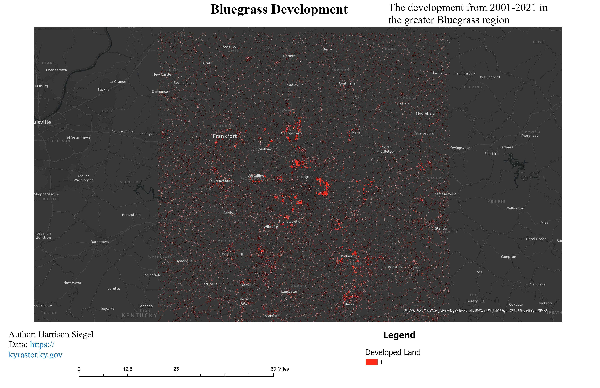

# Bluegrass Area Development

## Development in the Bluegrass area of Kentucky between the years of 2001 and 2021

In 20 years of development in the Bluegrass area there has been much change. Lexington has seen much growth in the eastern and northern regions of the city. Georgetown's growth has been focused on the outer-loop of the city with little infill. The region between Lexington and Nicholasville has seen much development as well. The states capital city, Frankfort, has not had nearly as much development as other cities in the region like Richmond, Berea, or Danville.

_Bluegrass Area Development_

[Link to high res pdf](Bluegrass_Metro.pdf)

This development research was created by Harrison Siegel for GEO 409 at the University of Kentucky. The data was sourced from *kyfromabove* and specifically from the raster data portal.
